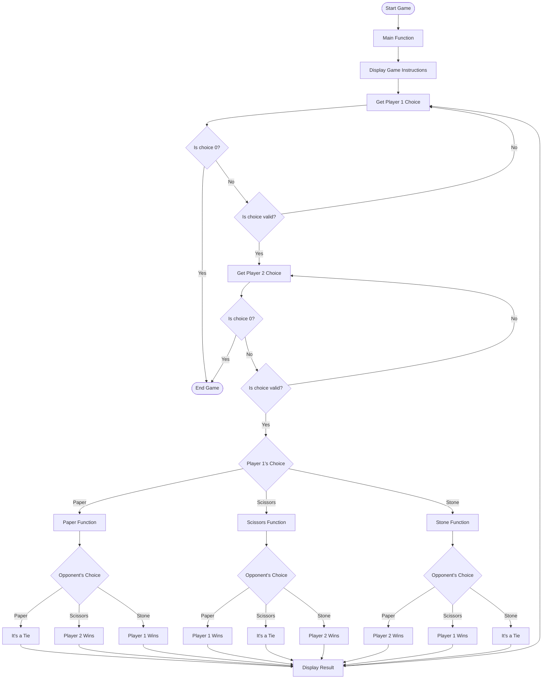

# Rock Paper Scissors Game Flowchart

```mermaid
flowchart TD
    Start([Start Game]) --> Main[Main Function]
    Main --> DisplayInstructions[Display Game Instructions]
    DisplayInstructions --> InputP1[Get Player 1 Choice]
    InputP1 --> CheckZeroP1{Is choice 0?}
    CheckZeroP1 -->|Yes| End([End Game])
    CheckZeroP1 -->|No| ValidateP1{Is choice valid?}
    ValidateP1 -->|No| InputP1
    ValidateP1 -->|Yes| InputP2[Get Player 2 Choice]
    InputP2 --> CheckZeroP2{Is choice 0?}
    CheckZeroP2 -->|Yes| End
    CheckZeroP2 -->|No| ValidateP2{Is choice valid?}
    ValidateP2 -->|No| InputP2
    ValidateP2 -->|Yes| Choice{Player 1's Choice}
    
    Choice -->|Paper| PaperFunc[Paper Function]
    Choice -->|Scissors| ScissorsFunc[Scissors Function]
    Choice -->|Stone| StoneFunc[Stone Function]
    
    PaperFunc --> PaperChoice{Opponent's Choice}
    PaperChoice -->|Paper| PaperTie[It's a Tie]
    PaperChoice -->|Scissors| PaperLose[Player 2 Wins]
    PaperChoice -->|Stone| PaperWin[Player 1 Wins]
    
    ScissorsFunc --> ScissorsChoice{Opponent's Choice}
    ScissorsChoice -->|Paper| ScissorsWin[Player 1 Wins]
    ScissorsChoice -->|Scissors| ScissorsTie[It's a Tie]
    ScissorsChoice -->|Stone| ScissorsLose[Player 2 Wins]
    
    StoneFunc --> StoneChoice{Opponent's Choice}
    StoneChoice -->|Paper| StoneLose[Player 2 Wins]
    StoneChoice -->|Scissors| StoneWin[Player 1 Wins]
    StoneChoice -->|Stone| StoneTie[It's a Tie]
    
    PaperTie --> DisplayResult
    PaperLose --> DisplayResult
    PaperWin --> DisplayResult
    ScissorsWin --> DisplayResult
    ScissorsTie --> DisplayResult
    ScissorsLose --> DisplayResult
    StoneLose --> DisplayResult
    StoneWin --> DisplayResult
    StoneTie --> DisplayResult
    
    DisplayResult[Display Result] --> InputP1
```